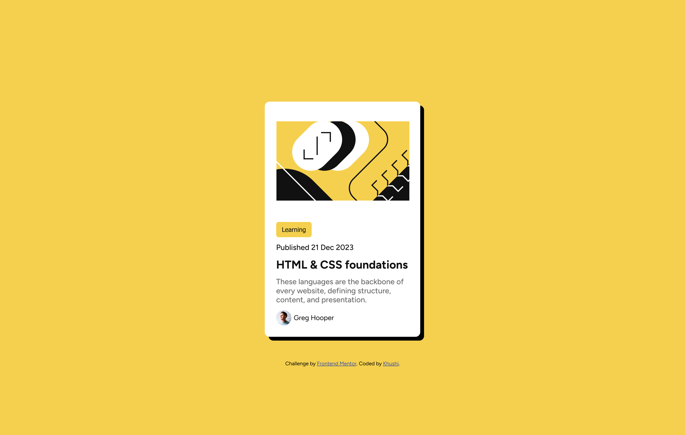

# Frontend Mentor - Blog Preview Card Solution

This is my solution to the [Blog Preview Card challenge on Frontend Mentor](https://www.frontendmentor.io/challenges/blog-preview-card-ckPaj01IcS). Frontend Mentor challenges help developers enhance their coding skills by building real-world projects.

## Table of Contents
- [Overview](#overview)
  - [The Challenge](#the-challenge)
  - [Screenshot](#screenshot)
  - [Links](#links)
- [My Process](#my-process)
  - [Built With](#built-with)
  - [What I Learned](#what-i-learned)
  - [Continued Development](#continued-development)
  - [Useful Resources](#useful-resources)
- [Author](#author)

## Overview

### The Challenge

Users should be able to:
- See hover and focus states for all interactive elements on the page

### Screenshot

#### Desktop View


#### Mobile View


### Links

- [Solution URL](https://github.com/Khushi1638/frontend-mentor-blog-challenge.git)
- [Live Site URL](https://khushi1638.github.io/frontend-mentor-blog-challenge/)

## My Process

### Built With

- Semantic HTML5 markup
- CSS custom properties
- Flexbox
- Responsive design with media queries

### What I Learned

This project helped me strengthen my understanding of:

- Structuring semantic HTML
- Styling components with CSS custom properties
- Implementing responsive design with media queries
- Creating hover and focus states for accessibility

#### Example Code Snippets

```html
<h2 class="blog-title">Blog Preview Card</h2>
```

```css
.blog-title {
  color: #333;
  font-size: 1.5rem;
}
```


### Continued Development

In future projects, I want to focus on:
- Enhancing accessibility with ARIA attributes
- Improving animations and transitions for a smoother user experience
- Exploring CSS Grid for more complex layouts

### Useful Resources

- [MDN Web Docs - CSS Flexbox](https://developer.mozilla.org/en-US/docs/Learn/CSS/CSS_layout/Flexbox) - Great for understanding flexbox layout.
- [Frontend Mentor](https://www.frontendmentor.io/) - Excellent platform for practice projects.

## Author

- Linkedin - [Khushi](https://www.linkedin.com/in/khushinagaliya)
- Twitter - [@learnwithkhushi](https://x.com/learnwithkhushi)


